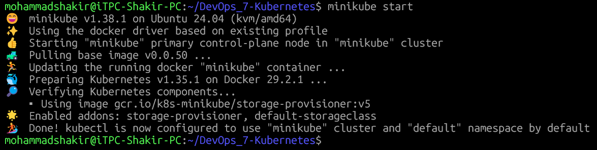
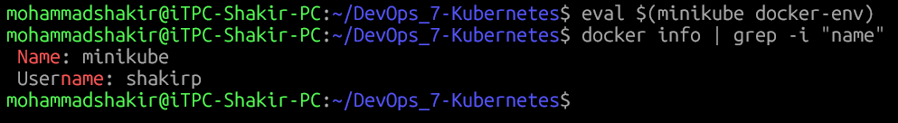
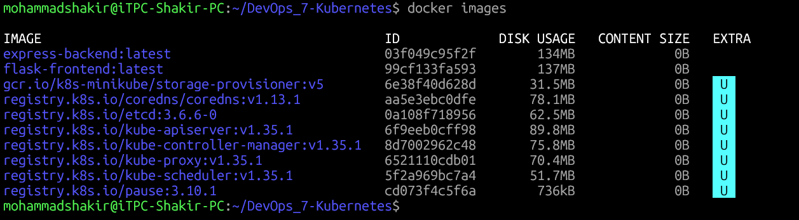
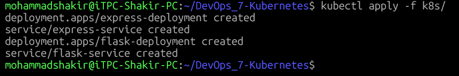
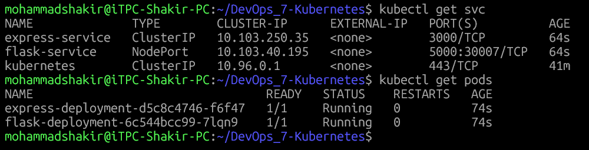
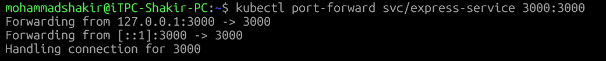
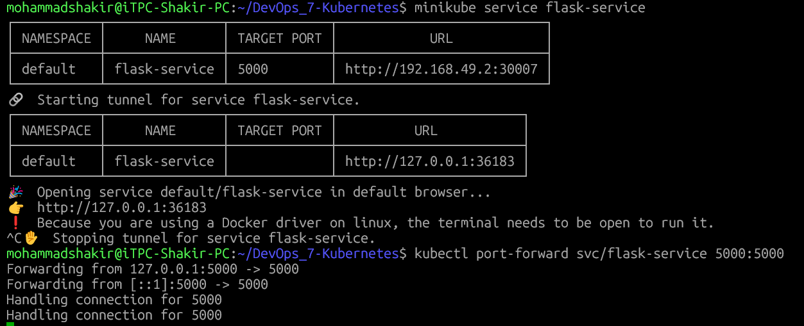
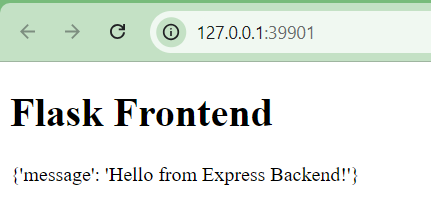

# Flask Frontend & Express Backend on Kubernetes (Minikube)

This project demonstrates deploying a **Flask frontend** and an **Express backend** on a **local Kubernetes cluster using Minikube**.  
The Flask frontend communicates with the Express backend using Kubernetes Services.

---

## 📁 Project Structure
 


---

## 🧩 Application Overview

| Component | Technology | Port |
|---------|-----------|------|
| Backend | Express (Node.js) | 3000 |
| Frontend | Flask (Python) | 5000 |

- Express backend exposes a REST endpoint.
- Flask frontend calls the backend using Kubernetes Service DNS.
- Applications are containerized using Docker and deployed on Minikube.

---

## 🔧 Prerequisites

- Docker
- Minikube
- kubectl
- Git

---

## ▶️ Deployment Steps

###  Start Minikube
```bash
minikube start
```
### 1. Minikube Start



---

### 2. Configure Docker to Use Minikube

```bash
eval $(minikube docker-env)
```

Verify:

```bash
docker info | grep Name
```



---

### 3. Build Docker Images

```bash
docker build -t express-backend ./express-backend
docker build -t flask-frontend ./flask-frontend
```

Verify:

```bash
docker images
```



---

### 4. Deploy to Kubernetes

```bash
kubectl apply -f k8s/
```



---

### 5. Verify Pods and Services

```bash
kubectl get pods
kubectl get svc
```



---

### 6. Verify Backend Output

```bash
kubectl port-forward svc/express-service 3000:3000
```

Open browser:

```
http://localhost:3000
```




---

### 7. Access Flask Frontend

```bash
minikube service flask-service
```






